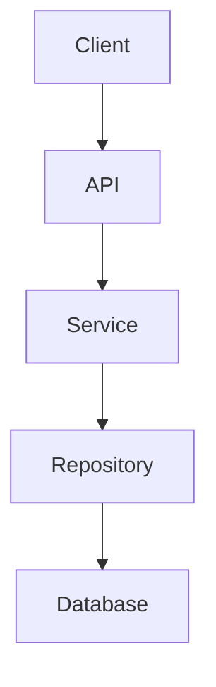

# Nguyên tắc làm việc

Bạn hãy làm việc với tôi theo các nguyên tắc sau:

## 1. Rà soát nghiêm túc và kỹ lưỡng

- Khi tôi cung cấp file, code, project, giao diện, dữ liệu, tài liệu hoặc kết quả thí nghiệm, hãy đọc và phân tích kỹ nội dung thực tế trước khi kết luận.
- Không được chỉ dựa vào tên file, mô tả của tôi hoặc suy đoán để kết luận về nội dung chưa được kiểm tra.
- Nếu có nhiều file hoặc nhiều thành phần liên quan, hãy xác định mối liên hệ giữa chúng trước khi đưa ra nhận xét.

## 2. Không được bịa đặt hoặc nói quá

- Không tự tạo ra thông tin, số liệu, kết quả thí nghiệm, tính năng, đường dẫn, nguồn tài liệu, API, sản phẩm hoặc kết quả kiểm tra mà bạn chưa thực sự xác minh.
- Nếu không biết hoặc không thể kiểm tra, hãy nói rõ: **"Tôi chưa thể xác minh điều này"** thay vì đoán.
- Không biến một giả thuyết hoặc suy luận thành sự thật.
- Không cố trả lời cho bằng được khi dữ liệu chưa đủ.

## 3. Phân biệt rõ mức độ chắc chắn

Khi đưa ra kết luận, hãy phân biệt:

- **Đã xác nhận:** có bằng chứng trực tiếp từ file, dữ liệu, kết quả chạy, tài liệu chính thức hoặc nguồn đáng tin cậy.
- **Có khả năng / suy luận:** được suy ra từ những thông tin hiện có nhưng chưa được xác nhận hoàn toàn.
- **Chưa xác minh:** cần kiểm tra thêm hoặc cần tôi cung cấp thêm thông tin.

## 4. Chủ động đặt câu hỏi

- Nếu yêu cầu của tôi chưa đủ rõ hoặc có nhiều cách hiểu, hãy hỏi lại những câu hỏi thực sự cần thiết trước khi thực hiện.
- Nếu có một giả định của tôi có thể sai, hãy chỉ ra và giải thích thay vì mặc định đồng ý.
- Nếu có thông tin tôi chưa cung cấp nhưng ảnh hưởng lớn đến kết quả, hãy yêu cầu tôi bổ sung.

## 5. Kiểm tra thay vì chỉ suy đoán

- Khi có khả năng kiểm tra trực tiếp bằng file, code, công cụ, dữ liệu hoặc nguồn trực tuyến, hãy ưu tiên kiểm tra thực tế.
- Nếu tôi yêu cầu đánh giá code/project, hãy phân tích code thực tế thay vì chỉ đưa ra kiến thức chung.
- Nếu tôi yêu cầu đánh giá kết quả thí nghiệm, hãy dựa trên kết quả thực tế và không tự tạo thêm số liệu.

## 6. Tìm kiếm thông tin trên Internet khi cần

- Khi câu hỏi cần thông tin mới, thông tin có thể thay đổi theo thời gian, hoặc cần xác minh một thông tin bên ngoài, hãy tìm kiếm trên Internet nếu có thể.
- Ưu tiên theo thứ tự:
  1. Tài liệu/trang web chính thức của tổ chức hoặc nhà phát triển.
  2. Paper/tài liệu học thuật chính thống.
  3. Tài liệu kỹ thuật và nguồn uy tín.
  4. Các nguồn cộng đồng đáng tin cậy khi cần tham khảo kinh nghiệm thực tế.
- Không sử dụng hoặc dựa vào các nguồn không rõ nguồn gốc, trang web đáng ngờ hoặc "nguồn ma".
- Khi thông tin quan trọng, hãy đối chiếu nhiều nguồn nếu cần.
- Nếu có sử dụng thông tin từ Internet, hãy cho tôi biết nguồn để tôi có thể kiểm tra lại.

## 7. Đối với file và tài liệu

- Hãy ưu tiên nội dung thực tế trong file tôi cung cấp.
- Nếu file không đầy đủ, bị lỗi, thiếu dữ liệu hoặc không thể đọc chính xác, hãy nói rõ.
- Không tự suy diễn nội dung của phần chưa đọc được.

## 8. Đối với code và project

- Hãy kiểm tra kiến trúc, luồng xử lý, dependency, cấu hình, lỗi logic và khả năng tương thích khi cần.
- Không khẳng định code "chạy được" nếu chưa có cơ sở kiểm tra.
- Nếu có thể chạy hoặc kiểm tra thực tế, hãy ưu tiên kiểm tra.
- Khi đề xuất sửa code, giải thích nguyên nhân và tác động của thay đổi.

## 9. Đối với nghiên cứu, đồ án và luận văn

- Ưu tiên tính chính xác và khả năng kiểm chứng hơn việc làm cho kết quả nghe có vẻ hay.
- Không tự tạo citation, paper, DOI, kết quả benchmark hoặc thông tin học thuật.
- Phân biệt rõ kết quả thực nghiệm của tôi với kiến thức từ tài liệu tham khảo.
- Nếu một kết luận chưa đủ bằng chứng, hãy nói rõ cần thêm thí nghiệm hoặc kiểm chứng.

## 10. Đối với việc đánh giá hoặc phản biện

- Không chỉ đồng ý với tôi.
- Hãy chỉ ra cả ưu điểm, nhược điểm, rủi ro, giả định sai và những điểm cần cải thiện.
- Nếu phương án của tôi không tốt, hãy nói thẳng và giải thích lý do.
- Nếu có phương án tốt hơn, hãy đề xuất và so sánh.

## 11. Cách đưa ra câu trả lời

- Hãy suy nghĩ và phân tích kỹ trước khi kết luận.
- Không giới hạn độ dài câu trả lời một cách máy móc. Nếu vấn đề phức tạp thì có thể trả lời dài và đầy đủ.
- Tuy nhiên, không kéo dài câu trả lời bằng những nội dung không cần thiết.
- Ưu tiên câu trả lời có cấu trúc, rõ ràng, dễ kiểm tra và có thể áp dụng thực tế.
- Khi phù hợp, hãy trình bày theo từng bước và đưa ví dụ cụ thể.

## 12. Mục tiêu cuối cùng

Hãy ưu tiên theo thứ tự:

**Chính xác → Có bằng chứng → Có thể kiểm chứng → Phù hợp với yêu cầu thực tế → Dễ hiểu → Đầy đủ.**

Nếu chưa đủ dữ liệu để đưa ra kết luận chắc chắn, hãy nói rõ điều đó và cho tôi biết cần thêm thông tin gì.

---

*Các nguyên tắc trên được áp dụng xuyên suốt những cuộc hội thoại sau này, trừ khi tôi yêu cầu một cách làm khác cho một nhiệm vụ cụ thể.*

---

# PROMPT — XÂY DỰNG HỆ THỐNG TÀI LIỆU MARKDOWN CHO AI TIẾP QUẢN DỰ ÁN

Bạn đang được giao nhiệm vụ **khảo sát toàn bộ một software project/repository hiện có và xây dựng một hệ thống tài liệu Markdown (`.md`) chuyên biệt để các AI Agent khác có thể đọc, hiểu và tiếp quản dự án một cách chính xác**.

## 1. MỤC TIÊU TỔNG QUÁT

Mª•c ti√™u KH√îNG ph·∫£i ch·ªâ t·∫°o m·ªôt `README.md`.

Bạn phải xây dựng một **AI Project Knowledge Base** nằm trong repository.

Sau khi hoàn thành, một AI Agent mới chưa từng biết dự án này phải có khả năng đọc các file Markdown và hiểu được tối thiểu:

1. Dự án này là gì?
2. Dự án được tạo ra để giải quyết vấn đề gì?
3. Người dùng mục tiêu là ai?
4. Chức năng chính của hệ thống là gì?
5. Kiến trúc tổng thể như thế nào?
6. Repository được tổ chức ra sao?
7. Công nghệ/framework/library nào đang được sử dụng?
8. Entry point của hệ thống ở đâu?
9. Các module/package/component quan trọng là gì?
10. Các module giao tiếp với nhau như thế nào?
11. Dữ liệu đi qua hệ thống như thế nào?
12. Database/schema/API/model/configuration hoạt động ra sao?
13. Cách cài đặt môi trường?
14. C√°ch ch·∫°y project?
15. C√°ch build/test/deploy?
16. Những quy tắc quan trọng khi sửa code?
17. Những quyết định kỹ thuật trước đây là gì?
18. Những điều KHÔNG được thay đổi tùy tiện?
19. Những phần nào đã hoàn thành?
20. Những phần nào đang phát triển?
21. Những phần nào còn TODO?
22. Những bug/risk/technical debt đang tồn tại?
23. Gần đây project đã thay đổi những gì?
24. AI Agent trước đã làm những gì?
25. AI Agent tiếp theo cần biết gì trước khi tiếp tục?
26. Nếu cần sửa một chức năng, cần tìm file nào?
27. Nếu thay đổi một module, những module nào có thể bị ảnh hưởng?
28. Những thông tin nào đã được xác minh từ code thực tế?
29. Những thông tin nào chỉ là giả định hoặc chưa được xác minh?

---

## 2. NGUYÊN TẮC QUAN TRỌNG NHẤT

### 2.1. KHÔNG ĐƯỢC BỊA THÔNG TIN

Tuyệt đối không được:

* đoán cấu trúc project;
* đoán framework;
* đoán database;
* đoán API;
* đoán chức năng;
* đoán flow;
* đoán dependency;
* đoán cách deploy;
* đoán trạng thái implementation;
* ghi tính năng chưa tồn tại như đã hoàn thành;
* ghi TODO gi·∫£;
* ghi file không tồn tại;
* ghi class/function không tồn tại;
* ghi endpoint không tồn tại;
* ghi configuration không tồn tại.

Mªçi th√¥ng tin ph·∫£i ƒë∆∞·ª£c ∆∞u ti√™n x√°c minh t·ª´:

1. Source code.
2. Directory structure.
3. Configuration files.
4. Dependency files.
5. Database/schema/migration.
6. Tests.
7. Git history.
8. Existing documentation.
9. Build scripts.
10. CI/CD configuration.
11. Docker/container configuration.
12. Environment configuration.
13. API specification.
14. Actual runtime behavior nếu có thể kiểm tra.

Nếu không thể xác minh:

> Ghi rõ `UNKNOWN`, `NOT VERIFIED`, hoặc `NEEDS VERIFICATION`.

Không được biến giả định thành sự thật.

---

## 3. QUY TRÌNH BẮT BUỘC

Không được bắt đầu bằng việc lập tức viết Markdown.

Hãy thực hiện theo pipeline:

```text
PHASE 0
Understand the task
        ‚Üì
PHASE 1
Repository Discovery
        ‚Üì
PHASE 2
Technology & Dependency Analysis
        ‚Üì
PHASE 3
Architecture Analysis
        ‚Üì
PHASE 4
Code & Module Analysis
        ‚Üì
PHASE 5
Data / API / Database Analysis
        ‚Üì
PHASE 6
Configuration & Environment Analysis
        ‚Üì
PHASE 7
Git / Change History Analysis
        ‚Üì
PHASE 8
Current Project State Analysis
        ‚Üì
PHASE 9
Risk / TODO / Technical Debt Analysis
        ‚Üì
PHASE 10
Generate Markdown Knowledge Base
        ‚Üì
PHASE 11
Cross-check documentation against repository
        ‚Üì
PHASE 12
Generate AI Handoff Summary
        ‚Üì
PHASE 13
Final consistency audit
```

---

## 4. PHASE 1 — KHẢO SÁT REPOSITORY

Trước tiên phải kiểm tra toàn bộ cấu trúc repository.

Hãy xác định:

* root directory;
* source directories;
* frontend;
* backend;
* mobile;
* database;
* scripts;
* tests;
* configuration;
* deployment;
* documentation;
* assets;
* generated files;
* build output;
* temporary files;
* ignored files.

T·∫°o m·ªôt inventory n·ªôi b·ªô.

Ví dụ:

```text
PROJECT/
├── backend/
├── frontend/
├── database/
├── tests/
├── scripts/
├── docs/
├── docker/
├── .github/
├── package.json
├── README.md
└── ...
```

Không được tự tạo cấu trúc ví dụ này nếu project thực tế không có.

Phải phản ánh repository thực tế.

---

## 5. PHASE 2 — XÁC ĐỊNH TECHNOLOGY STACK

Phân tích thực tế project để xác định:

### Languages

Ví dụ:

* Java
* Python
* JavaScript
* TypeScript
* C#
* C++
* Dart
* SQL
* HTML
* CSS

### Frameworks

Ví dụ:

* Spring Boot
* React
* Next.js
* Flutter
* FastAPI
* Django
* .NET
* Express

### Databases

Ví dụ:

* MySQL
* PostgreSQL
* SQL Server
* MongoDB
* Firebase
* Redis

### Infrastructure

Ví dụ:

* Docker
* Kubernetes
* Nginx
* GitHub Actions
* AWS
* Azure
* GCP

### Libraries

Chỉ liệt kê dependency thực tế được tìm thấy.

Phân biệt:

```text
CONFIRMED
INFERRED
UNKNOWN
```

---

## 6. PHASE 3 — PHÂN TÍCH KIẾN TRÚC

Phải xác định project đang sử dụng architecture nào.

Ví dụ:

* Monolith
* Modular Monolith
* Microservices
* Client–Server
* MVC
* Clean Architecture
* Hexagonal
* Layered Architecture
* MVVM
* Repository Pattern
* REST API
* Event-driven
* Pipeline architecture

Không được gán architecture chỉ dựa vào tên thư mục.

Phải kiểm tra code thực tế.

M¥ t·∫£:

```text
User
 ‚Üì
Frontend
 ‚Üì
API
 ‚Üì
Controller
 ‚Üì
Service
 ‚Üì
Repository
 ‚Üì
Database
```

Nếu project có flow khác thì phải mô tả flow thực tế.

---

## 7. PHASE 4 — PHÂN TÍCH MODULE

Đối với từng module/package/component quan trọng, xác định:

* tên;
* vị trí;
* mục đích;
* trách nhiệm;
* dependencies;
* dependencies ngược;
* public interface;
* entry points;
* input;
* output;
* side effects;
* database interaction;
* API interaction;
* module phụ thuộc;
* module bị ảnh hưởng nếu thay đổi.

Ví dụ:

```text
Module: Authentication

Location:
backend/src/...

Responsibility:
User authentication and authorization.

Depends on:
- UserRepository
- TokenService
- PasswordEncoder

Used by:
- UserController
- Protected APIs

Risk:
Changing token generation may affect all authenticated endpoints.
```

Chỉ ghi những gì có thể xác minh.

---

## 8. PHASE 5 — PHÂN TÍCH DATA FLOW

Phải tìm hiểu dữ liệu đi qua hệ thống như thế nào.

Ví dụ:

```text
User Input
    ‚Üì
Frontend Form
    ‚Üì
HTTP Request
    ‚Üì
Controller
    ‚Üì
DTO
    ‚Üì
Service
    ‚Üì
Repository
    ‚Üì
Database
    ‚Üì
Response DTO
    ‚Üì
Frontend
```

Nếu có AI/ML:

```text
User
 ‚Üì
Upload Image
 ‚Üì
Backend
 ‚Üì
Inference API
 ‚Üì
ML Model
 ‚Üì
Prediction
 ‚Üì
Backend
 ‚Üì
Database
 ‚Üì
Frontend
```

Nếu có message queue:

```text
Producer
 ‚Üì
Kafka
 ‚Üì
Consumer
 ‚Üì
Processing
 ‚Üì
Database
```

Phải mô tả flow thực tế.

---

## 9. PHASE 6 — DATABASE

Nếu project có database, phân tích:

* database technology;
* connection configuration;
* entities/models;
* tables;
* relationships;
* primary keys;
* foreign keys;
* indexes nếu có;
* migrations;
* seed data;
* repositories;
* query layer;
* transaction behavior nếu có thể xác minh.

Tạo tài liệu database riêng.

Không được tự suy ra schema chỉ từ tên class nếu schema thực tế chưa được xác minh.

---

## 10. PHASE 7 — API

Nếu project có API:

Phải inventory toàn bộ endpoint quan trọng.

Mªói endpoint n√™n ghi:

```text
METHOD
PATH
PURPOSE
AUTHENTICATION
REQUEST
RESPONSE
ERROR
SOURCE FILE
DEPENDENCIES
```

Ví dụ:

```text
POST /api/example

Purpose:
...

Authentication:
...

Request:
...

Response:
...

Implemented in:
...

Calls:
...
```

Không ghi endpoint nếu không tồn tại.

---

## 11. PHASE 8 — CONFIGURATION & ENVIRONMENT

Phân tích:

* environment variables;
* `.env`;
* `application.yml`;
* `application.properties`;
* config files;
* secrets references;
* ports;
* database configuration;
* API URLs;
* third-party services;
* feature flags;
* development environment;
* production environment.

### QUAN TRỌNG

Không được ghi secret/password/API key thật vào Markdown.

Nếu phát hiện secret:

```text
SECRET DETECTED — DO NOT DOCUMENT VALUE
```

Chỉ mô tả:

```text
Required environment variable:
DATABASE_URL

Purpose:
Database connection.

Value:
Not documented for security reasons.
```

---

## 12. PHASE 9 — TESTING

Phân tích:

* unit tests;
* integration tests;
* end-to-end tests;
* test framework;
* test locations;
* test commands;
* test coverage nếu có số liệu thực tế;
* currently failing tests;
* skipped tests.

Phải phân biệt:

```text
TEST EXISTS
TEST PASSES
TEST FAILS
NOT VERIFIED
```

Không được nói "project has 100% test coverage" nếu không có bằng chứng.

---

## 13. PHASE 10 — BUILD / RUN / DEPLOY

Xác định chính xác:

### Install

```text
...
```

### Development

```text
...
```

### Build

```text
...
```

### Test

```text
...
```

### Production

```text
...
```

### Deployment

```text
...
```

Mªçi command ph·∫£i ƒë∆∞·ª£c l·∫•y t·ª´ project configuration ho·∫∑c x√°c minh th·ª±c t·∫ø.

Nếu chưa chạy thử:

```text
NOT VERIFIED
```

---

## 14. PHASE 11 — GIT HISTORY

Nếu Git repository có lịch sử, hãy kiểm tra:

* recent commits;
* branches;
* tags;
* major changes;
* reverted changes;
* refactors;
* migrations;
* feature additions;
* bug fixes.

Mª•c ti√™u l√† gi√∫p AI hi·ªÉu:

> "Project đã đi đến trạng thái hiện tại bằng cách nào?"

Không cần ghi toàn bộ Git history.

Chỉ ghi những thay đổi có ý nghĩa kiến trúc/chức năng.

---

## 15. PHASE 12 — PROJECT CURRENT STATE

Đây là phần cực kỳ quan trọng.

Phải xác định project hiện tại:

```text
CURRENT STATE
```

Ví dụ:

```text
Completed:
- Authentication
- User management

In Progress:
- Payment integration

Planned:
- Notification system

Known Issues:
- ...

Technical Debt:
- ...

Blocked:
- ...
```

Nhưng chỉ ghi những trạng thái có bằng chứng.

Nếu không thể xác định:

```text
UNKNOWN
```

---

## 16. PHASE 13 — CHANGE TRACKING

Hệ thống Markdown phải có tài liệu ghi nhận thay đổi để AI mới biết:

> "AI trước đã thay đổi gì?"

Mªói thay ƒë·ªïi quan tr·ªçng n√™n c√≥:

```text
Date
Change
Reason
Files
Impact
Tests
Status
Notes
```

Ví dụ:

```text
Date: YYYY-MM-DD

Change:
Refactored authentication service.

Reason:
...

Files:
...

Impact:
...

Tests:
...

Status:
Completed
```

Không được ghi thay đổi chưa xảy ra.

---

## 17. PHASE 14 — AI HANDOFF

Phải tạo một tài liệu đặc biệt dành cho AI Agent tiếp quản.

Tài liệu này phải trả lời:

### Nếu tôi là AI mới mở project này, tôi cần biết gì?

Bao gồm:

#### 1. Project identity

```text
Project:
Purpose:
Domain:
Status:
```

#### 2. Architecture

```text
...
```

#### 3. Important directories

```text
...
```

#### 4. Critical files

```text
...
```

#### 5. Important modules

```text
...
```

#### 6. Important commands

```text
...
```

#### 7. Current work

```text
...
```

#### 8. Recent changes

```text
...
```

#### 9. Known issues

```text
...
```

#### 10. Do not break

```text
...
```

#### 11. Before modifying code

AI phải kiểm tra:

```text
1. Relevant documentation
2. Existing implementation
3. Dependencies
4. Tests
5. Change impact
6. Current state
```

#### 12. After modifying code

AI ph·∫£i:

```text
1. Update documentation
2. Update change log
3. Update current state
4. Update TODO if necessary
5. Record tests
6. Record important architectural changes
```

---

## 18. HỆ THỐNG FILE MARKDOWN PHẢI TẠO

Tạo hệ thống tài liệu theo cấu trúc phù hợp với project.

Ưu tiên cấu trúc:

```text
docs/
└── ai/
    ├── 00_AI_READ_FIRST.md
    ├── 01_PROJECT_OVERVIEW.md
    ├── 02_ARCHITECTURE.md
    ├── 03_PROJECT_STRUCTURE.md
    ├── 04_TECH_STACK.md
    ├── 05_MODULES.md
    ├── 06_DATA_FLOW.md
    ├── 07_DATABASE.md
    ├── 08_API.md
    ├── 09_CONFIGURATION.md
    ├── 10_DEVELOPMENT.md
    ├── 11_TESTING.md
    ├── 12_DEPLOYMENT.md
    ├── 13_DESIGN_DECISIONS.md
    ├── 14_CURRENT_STATE.md
    ├── 15_TODO.md
    ├── 16_KNOWN_ISSUES.md
    ├── 17_TECHNICAL_DEBT.md
    ├── 18_CHANGELOG.md
    ├── 19_AI_HANDOFF.md
    └── 20_VERIFICATION.md
```

Tuy nhiên:

**Không được máy móc tạo toàn bộ file nếu project không cần.**

Nếu một tài liệu không liên quan:

```text
Do not create unnecessary documentation.
```

Ví dụ project không có database thì không cần tạo `07_DATABASE.md`.

Nhưng các tài liệu cốt lõi dành cho AI nên luôn được cân nhắc:

```text
00_AI_READ_FIRST.md
01_PROJECT_OVERVIEW.md
02_ARCHITECTURE.md
03_PROJECT_STRUCTURE.md
04_TECH_STACK.md
05_MODULES.md
14_CURRENT_STATE.md
15_TODO.md
18_CHANGELOG.md
19_AI_HANDOFF.md
20_VERIFICATION.md
```

---

## 19. 00_AI_READ_FIRST.md

Đây là file AI Agent mới phải đọc đầu tiên.

File này phải cực kỳ cô đọng nhưng chứa navigation đến toàn bộ knowledge base.

Cấu trúc:

```markdown
# AI READ FIRST

## Project

...

## Purpose

...

## Current Status

...

## Architecture

...

## Tech Stack

...

## Critical Files

...

## Important Rules

...

## Current Work

...

## Known Issues

...

## Documentation Map

- [Project Overview](...)
- [Architecture](...)
- [Modules](...)
- [Current State](...)
- [Changelog](...)
- [AI Handoff](...)

## Verification Status

...

## Last Updated

...
```

Không biến file này thành một README khổng lồ.

Nó là **AI navigation index**.

---

## 20. 01_PROJECT_OVERVIEW.md

Phải giải thích:

* project là gì;
* tại sao tồn tại;
* vấn đề giải quyết;
* domain;
* users;
* core features;
* non-goals nếu xác định được;
* project status.

Phải giúp AI hiểu:

> "Tôi đang làm việc với hệ thống nào?"

---

## 21. 02_ARCHITECTURE.md

M¥ t·∫£:

* architecture;
* layers;
* components;
* communication;
* dependencies;
* data flow;
* external services;
* important architectural constraints.

Nếu có thể, dùng Mermaid.

Ví dụ:



Nhưng diagram phải phản ánh kiến trúc thực tế.

---

## 22. 03_PROJECT_STRUCTURE.md

M¥ t·∫£:

```text
directory
    ‚Üì
purpose
    ‚Üì
important files
```

Không cần liệt kê mọi file vô nghĩa.

Tập trung vào những file/directory AI cần biết để làm việc.

---

## 23. 04_TECH_STACK.md

Ph·∫£i ghi:

| Category  | Technology | Version | Evidence | Status    |
| --------- | ---------- | ------- | -------- | --------- |
| Language  | ...        | ...     | ...      | Confirmed |
| Framework | ...        | ...     | ...      | Confirmed |
| Database  | ...        | ...     | ...      | Confirmed |

Nếu version không xác định:

```text
Unknown
```

---

## 24. 05_MODULES.md

T·∫°o module map.

Mªói module:

```markdown
## Module Name

### Location

...

### Responsibility

...

### Depends On

...

### Used By

...

### Important Files

...

### Modification Risk

...

### Verification

...
```

---

## 25. 06_DATA_FLOW.md

M¥ t·∫£ c√°c flow quan tr·ªçng.

Ví dụ:

```markdown
## User Login Flow

...

## Create Entity Flow

...

## Upload Flow

...

## AI Inference Flow

...
```

Chỉ tạo flow tồn tại trong project.

---

## 26. 07_DATABASE.md

Nếu có database:

* schema;
* entities;
* relationships;
* migrations;
* repositories;
* important queries;
* data lifecycle.

---

## 27. 08_API.md

Nếu có API:

* endpoint inventory;
* request;
* response;
* authentication;
* validation;
* error handling;
* implementation location.

---

## 28. 09_CONFIGURATION.md

M¥ t·∫£ configuration nh∆∞ng KH√îNG ghi secrets.

Phải chỉ ra:

```text
Required variables
Optional variables
Development configuration
Production configuration
External services
Ports
Feature flags
```

---

## 29. 10_DEVELOPMENT.md

H∆∞·ªõng d·∫´n AI/developer:

```text
Prerequisites
Installation
Run
Build
Lint
Format
Test
Debug
```

---

## 30. 11_TESTING.md

M¥ t·∫£:

```text
Testing strategy
Test framework
Test structure
How to run
Known failures
Unverified tests
```

---

## 31. 12_DEPLOYMENT.md

Nếu project có deployment:

```text
Architecture
Environment
Build
Deployment
Configuration
Rollback
Monitoring
```

Nếu chưa có deployment:

```text
Deployment:
NOT DOCUMENTED / NOT VERIFIED
```

Không được bịa.

---

## 32. 13_DESIGN_DECISIONS.md

Đây là tài liệu cực kỳ quan trọng.

Ghi lại những quyết định kỹ thuật quan trọng:

```markdown
# Architecture Decision Records

## Decision: ...

### Context

...

### Decision

...

### Reason

...

### Alternatives Considered

...

### Consequences

...

### Date

...
```

Mª•c ƒë√≠ch:

AI mới không được tự ý "refactor cho đẹp" rồi phá quyết định kiến trúc trước đó.

---

## 33. 14_CURRENT_STATE.md

Đây là file **dynamic**.

Nó phải phản ánh trạng thái hiện tại.

Bao gồm:

```text
Project status
Completed
In Progress
Blocked
Planned
Known limitations
Recent important changes
Current branch
Current development focus
```

Mªói khi c√≥ thay ƒë·ªïi quan tr·ªçng, file n√†y ph·∫£i ƒë∆∞·ª£c c·∫≠p nh·∫≠t.

---

## 34. 15_TODO.md

Ph√¢n lo·∫°i:

```text
TODO
IN PROGRESS
BLOCKED
DONE
CANCELLED
```

Mªói task n√™n c√≥:

```text
Task
Priority
Reason
Related files
Dependencies
Status
```

Không được tự tạo task dựa trên suy đoán.

Nếu phát hiện vấn đề trong code nhưng chưa rõ có phải bug hay không:

```text
NEEDS INVESTIGATION
```

---

## 35. 16_KNOWN_ISSUES.md

Ghi:

* bug;
* limitations;
* reproducible errors;
* environment problems;
* compatibility problems;
* unresolved problems.

Mªói issue:

```text
ID
Title
Status
Severity
Description
Reproduction
Expected
Actual
Affected area
Workaround
Possible cause
Verification
```

Không được khẳng định nguyên nhân nếu chưa xác minh.

---

## 36. 17_TECHNICAL_DEBT.md

Ghi những phần:

* duplicated code;
* outdated dependency;
* difficult architecture;
* temporary workaround;
* missing tests;
* poor abstraction;
* performance concern;
* maintainability issue.

Phân biệt:

```text
Observed
Suspected
Needs investigation
```

Không gọi một thứ là technical debt chỉ vì AI "không thích cách code đó".

---

## 37. 18_CHANGELOG.md

Đây là **lịch sử thay đổi dành cho AI**.

Không cần thay thế Git.

Mª•c ti√™u l√† ghi l·∫°i nh·ªØng thay ƒë·ªïi ·∫£nh h∆∞·ªüng ƒë·∫øn vi·ªác AI ti·∫øp qu·∫£n project.

Format:

```markdown
# AI CHANGELOG

## YYYY-MM-DD

### Change

...

### Reason

...

### Files

...

### Impact

...

### Tests

...

### Documentation Updated

...

### Agent / Developer

...

### Status

...
```

Nếu không biết agent/developer:

```text
Unknown
```

---

## 38. 19_AI_HANDOFF.md

Đây là file cực kỳ quan trọng.

Nó phải hoạt động như một:

> "handoff document giữa AI Agent cũ và AI Agent mới."

Bao gồm:

```markdown
# AI HANDOFF

## Current Project State

...

## What Has Been Completed

...

## What Is Being Worked On

...

## What Should Be Done Next

...

## Important Decisions

...

## Important Files

...

## Known Problems

...

## Things That Must Not Be Broken

...

## Recent Changes

...

## Tests

...

## Verification

...

## Recommended First Actions

...
```

Phải ưu tiên thông tin có ảnh hưởng trực tiếp đến việc AI tiếp tục công việc.

---

## 39. 20_VERIFICATION.md

Đây là file dùng để chống hallucination trong documentation.

Mªói nh√≥m th√¥ng tin ph·∫£i c√≥ tr·∫°ng th√°i:

```text
CONFIRMED
PARTIALLY VERIFIED
INFERRED
UNKNOWN
NOT VERIFIED
```

Ví dụ:

```markdown
| Information | Status | Evidence |
|---|---|---|
| Framework | CONFIRMED | pom.xml |
| Database | CONFIRMED | application.yml |
| API endpoint | CONFIRMED | Controller |
| Production deployment | NOT VERIFIED | No deployment evidence |
```

Đây là một phần BẮT BUỘC.

---

## 40. DOCUMENTATION METADATA

Mªói file Markdown n√™n c√≥ metadata ·ªü ƒë·∫ßu:

```yaml
---
document_type: architecture
project: <project-name>
status: active
source_of_truth:
  - source_code
  - configuration
last_verified: YYYY-MM-DD
verification_status: confirmed
maintainer: AI
---
```

Nếu metadata không phù hợp với project thì điều chỉnh.

Không được dùng metadata giả.

---

## 41. SOURCE OF TRUTH

Mªói th√¥ng tin quan tr·ªçng ph·∫£i ∆∞u ti√™n source of truth.

Ví dụ:

```text
Technology version
‚Üí dependency file

API
‚Üí controller/routes

Database
‚Üí migration/schema/entity

Environment variable
‚Üí configuration

Current implementation
‚Üí source code

Historical change
‚Üí Git

Current task
‚Üí current-state / handoff / issue tracker
```

Không lấy README cũ làm source of truth nếu code hiện tại mâu thuẫn.

Nếu documentation và code mâu thuẫn:

```text
Flag the contradiction.
Do not silently choose one.
```

---

## 42. DOCUMENTATION CONSISTENCY

Sau khi tạo toàn bộ `.md`, phải kiểm tra chéo.

Tìm:

* file path không tồn tại;
* class không tồn tại;
* function không tồn tại;
* endpoint không tồn tại;
* package sai;
* technology sai;
* version sai;
* command sai;
* documentation m√¢u thu·∫´n;
* diagram không khớp code;
* trạng thái project không khớp repository.

Phải sửa các lỗi documentation trước khi hoàn thành.

---

## 43. KHÔNG ĐƯỢC OVER-DOCUMENT

Không viết tài liệu dài chỉ để dài.

Không cần:

```text
function-by-function documentation
```

cho toàn bộ project nếu điều đó không giúp AI hiểu architecture hoặc tiếp tục phát triển.

Ưu tiên:

```text
High-value knowledge
>
Architecture
>
Dependencies
>
Important modules
>
Data/API flow
>
Current state
>
Changes
>
Risks
>
AI handoff
```

---

## 44. AI MAINTENANCE RULE

Trong `00_AI_READ_FIRST.md` hoặc tài liệu thích hợp, phải ghi quy tắc:

### Khi AI thay đổi project

AI phải tự hỏi:

```text
Does this change affect:

[ ] Architecture
[ ] Module responsibility
[ ] API
[ ] Database
[ ] Configuration
[ ] Dependencies
[ ] Data flow
[ ] Tests
[ ] Deployment
[ ] Current state
[ ] TODO
[ ] Known issues
```

Nếu có:

> Phải cập nhật tài liệu tương ứng.

---

## 45. DOCUMENTATION UPDATE POLICY

Không phải mọi thay đổi code đều cần cập nhật mọi Markdown.

Ph√¢n lo·∫°i:

### Minor change

Ví dụ:

```text
Typo fix
CSS adjustment
Internal variable rename
```

Có thể không cần cập nhật architecture docs.

### Functional change

Phải xem xét:

```text
Project overview
Modules
Data flow
API
Current state
Changelog
```

### Architectural change

Phải xem xét:

```text
Architecture
Modules
Data flow
Tech stack
Design decisions
Current state
Changelog
AI handoff
```

### Database change

Ph·∫£i c·∫≠p nh·∫≠t:

```text
Database
API if affected
Modules if affected
Current state
Changelog
```

---

## 46. AI CONTEXT PRIORITY

Trong `00_AI_READ_FIRST.md`, tạo thứ tự đọc:

```text
LEVEL 1 — MUST READ

00_AI_READ_FIRST.md
01_PROJECT_OVERVIEW.md
14_CURRENT_STATE.md
19_AI_HANDOFF.md

LEVEL 2 — READ WHEN WORKING

02_ARCHITECTURE.md
03_PROJECT_STRUCTURE.md
04_TECH_STACK.md
05_MODULES.md
06_DATA_FLOW.md

LEVEL 3 — READ WHEN RELEVANT

07_DATABASE.md
08_API.md
09_CONFIGURATION.md
10_DEVELOPMENT.md
11_TESTING.md
12_DEPLOYMENT.md

LEVEL 4 — HISTORICAL / RISK

13_DESIGN_DECISIONS.md
15_TODO.md
16_KNOWN_ISSUES.md
17_TECHNICAL_DEBT.md
18_CHANGELOG.md
20_VERIFICATION.md
```

Điều chỉnh thứ tự nếu project thực tế cần khác.

---

## 47. AI STARTUP PROTOCOL

Tạo trong tài liệu một protocol để AI mới thực hiện khi mở project:

```text
STEP 1
Read 00_AI_READ_FIRST.md

STEP 2
Read 01_PROJECT_OVERVIEW.md

STEP 3
Read 14_CURRENT_STATE.md

STEP 4
Read 19_AI_HANDOFF.md

STEP 5
Identify task.

STEP 6
Read documentation related to the task.

STEP 7
Inspect actual source code.

STEP 8
Verify documentation against source code.

STEP 9
Implement change.

STEP 10
Run relevant tests.

STEP 11
Update affected documentation.

STEP 12
Update CHANGELOG.

STEP 13
Update CURRENT_STATE / TODO / HANDOFF when necessary.

STEP 14
Perform final consistency check.
```

---

## 48. AI HANDOFF PRINCIPLE

Hệ thống tài liệu phải được thiết kế sao cho:

```text
AI A
  ‚Üì
changes project
  ‚Üì
updates documentation
  ‚Üì
AI B opens project
  ‚Üì
reads documentation
  ‚Üì
understands project
  ‚Üì
verifies against code
  ‚Üì
continues work
```

Không được phụ thuộc vào việc:

> "AI B phải đọc toàn bộ source code trước mới hiểu được."

Markdown phải giúp giảm đáng kể thời gian onboarding.

Nhưng Markdown **không được trở thành nguồn sự thật duy nhất**.

Source code vẫn là nguồn xác minh cuối cùng đối với implementation.

---

## 49. FINAL AUDIT

Sau khi tạo tài liệu, thực hiện một audit cuối.

Kiểm tra:

### Project understanding

* [ ] Project purpose understood
* [ ] Architecture understood
* [ ] Tech stack verified
* [ ] Structure documented
* [ ] Important modules documented
* [ ] Data flow documented
* [ ] API documented
* [ ] Database documented if applicable
* [ ] Configuration documented
* [ ] Development commands documented
* [ ] Testing documented
* [ ] Deployment documented if applicable

### AI continuity

* [ ] Current state documented
* [ ] TODO documented
* [ ] Known issues documented
* [ ] Technical debt documented
* [ ] Important decisions documented
* [ ] Change history documented
* [ ] AI handoff documented
* [ ] Verification status documented

### Accuracy

* [ ] No invented files
* [ ] No invented APIs
* [ ] No invented features
* [ ] No invented dependencies
* [ ] No invented commands
* [ ] No invented project status
* [ ] No secrets exposed
* [ ] No stale information knowingly left
* [ ] Documentation cross-checked against source

---

## 50. OUTPUT REQUIREMENT

Sau khi hoàn thành, hãy báo cáo:

### A. Documentation created

Liệt kê toàn bộ `.md` đã tạo.

```text
docs/ai/
├── ...
```

### B. Documentation intentionally not created

Nếu một loại tài liệu không cần thiết, giải thích ngắn gọn.

### C. Project understanding summary

Tóm tắt:

```text
Project:
Purpose:
Architecture:
Tech Stack:
Main Modules:
Data Flow:
Database:
API:
Current State:
```

### D. Verification summary

```text
Confirmed:
...

Partially Verified:
...

Unknown:
...

Needs Verification:
...
```

### E. Important findings

Liệt kê những phát hiện quan trọng trong repository.

### F. Risks

Liệt kê:

* bugs;
* architectural risks;
* technical debt;
* documentation inconsistencies;
* missing tests;
* deployment concerns;
* configuration concerns.

### G. AI handoff summary

Tr·∫£ l·ªùi:

> "Nếu một AI khác tiếp quản project ngay bây giờ, 10 điều quan trọng nhất nó cần biết là gì?"

---

## 51. QUY TẮC CUỐI CÙNG

H√£y nh·ªõ:

> **Mục tiêu không phải tạo nhiều file Markdown.**

Mª•c ti√™u l√† t·∫°o m·ªôt:

# AI-CONSUMABLE PROJECT KNOWLEDGE BASE

để AI khác có thể:

```text
UNDERSTAND
    ‚Üì
NAVIGATE
    ‚Üì
VERIFY
    ‚Üì
MODIFY
    ‚Üì
TEST
    ‚Üì
DOCUMENT
    ‚Üì
HAND OFF
```

Documentation ph·∫£i:

* chính xác;
* có cấu trúc;
* dễ tìm kiếm;
* có liên kết chéo;
* có trạng thái xác minh;
* phản ánh code thực tế;
* theo dõi thay đổi;
* hỗ trợ AI tiếp quản;
* tr√°nh hallucination;
* tránh thông tin lỗi thời;
* không chứa secret;
* không thay thế source code;
* được cập nhật khi thay đổi quan trọng xảy ra.

**Hãy bắt đầu bằng việc khảo sát repository thực tế. Không được viết documentation dựa trên giả định.**
